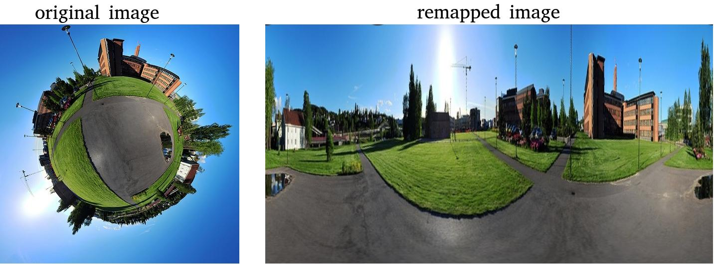

# OpenCVRemap360Image

Simple program for remapping 360 images/videos.

## Build:
``` 
$ mkdir build && cd build 
$ cmake ../src
$ make -j4
```

## How to use:
```
Usage: Remap360Image [params] 

        -?, -h, --help, --usage (value:true)
                print this message
        --image (value:<none>)
                Input Image
        --opt_remap (value:false)
                Optimize remap matrices
        --out_file (value:<none>)
                Output Image/Video
        --out_h (value:700)
                Out Height
        --out_w (value:1920)
                Out Width
        --r1 (value:1.0)
                Inner radius
        --r2 (value:0.1)
                Outer radius
        --video (value:<none>)
                Input video
```
### Example 1 (image):
```
./Remap360Image --image=image360.jpg
```
Saving the output:
```
./Remap360Image --image=image360.jpg --out_file=output.jpg 
```

### Example 2 (video)
```
./Remap360Image --video=video360.mp4
```
Saving the output:
```
./Remap360Image --video=video360.mp4 --out_file=output.mp4
```

## Gallery:


